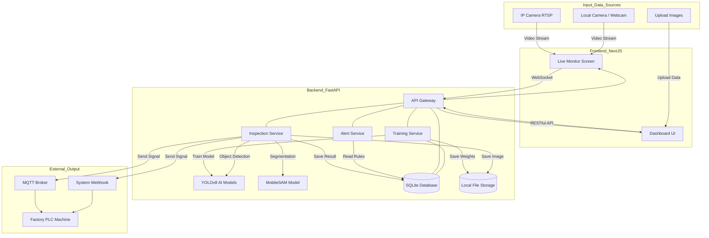
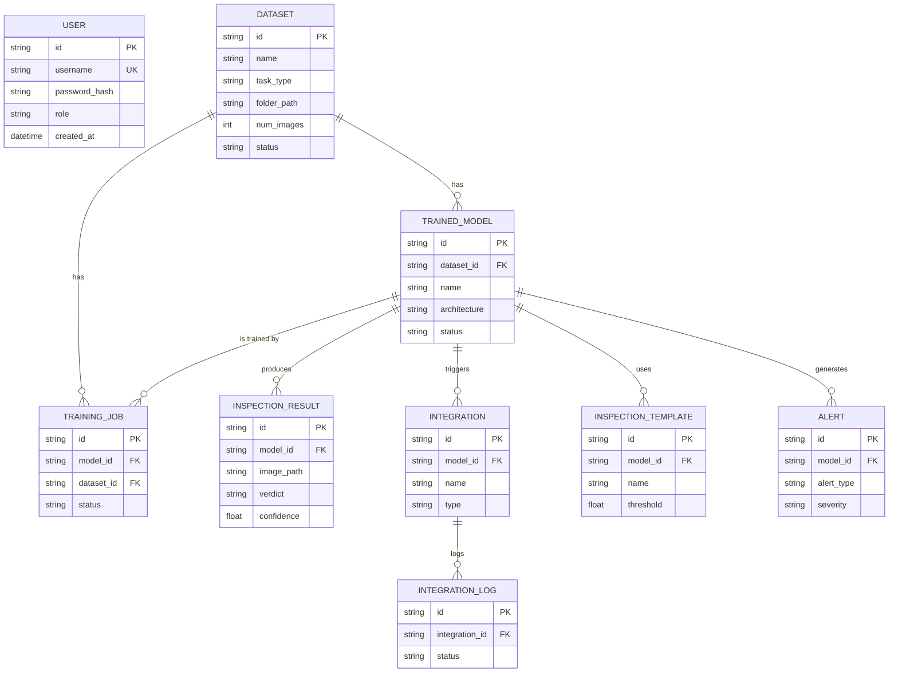
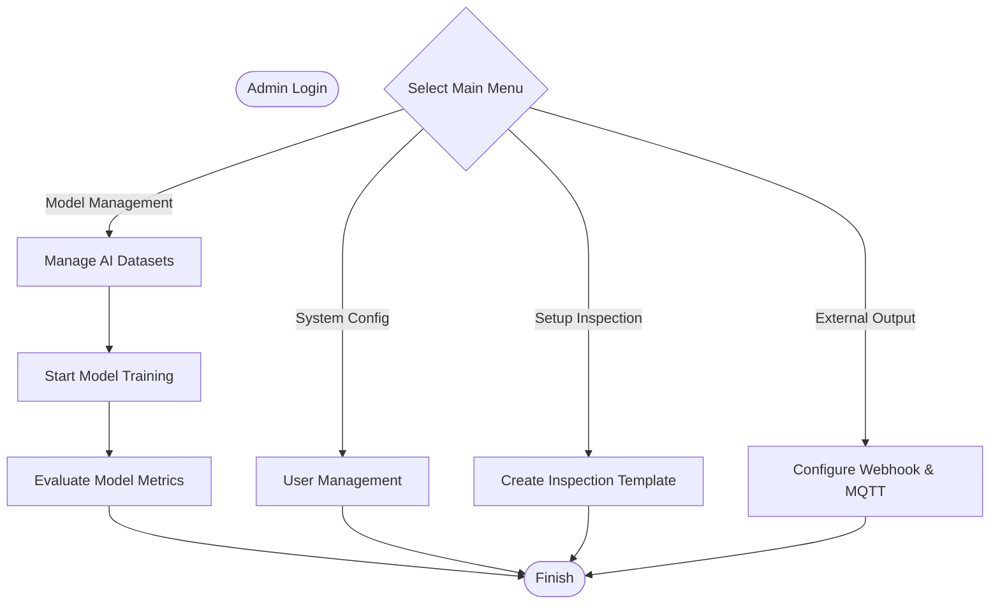
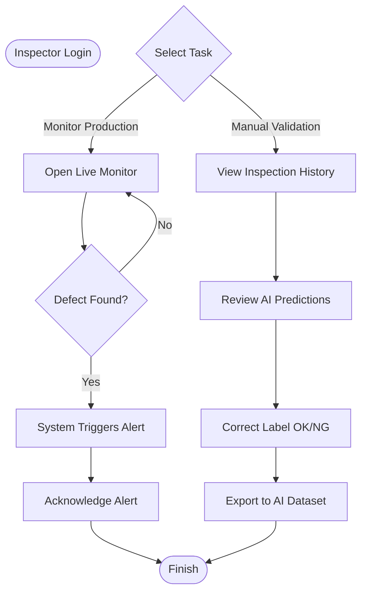

# Camera AI – Dynamic Software

## Project Objective

This project is based on WINTEQ's "Camera AI – Dynamic Software" use case: a flexible, on-premise AI vision platform that lets industries deploy, train, and scale visual inspection applications without engineers rewriting code for every new customer.

### Business Problem
The legacy Camera AI application relies heavily on hardcoded configurations and business logic, requiring direct source code changes by the development team. This makes the solution difficult to adapt and replicate across different customers, limiting scalability. Maintaining and deploying customized versions increases both development effort and long-term support costs.

### Goal
Transform Camera AI into a flexible, configurable platform that adapts to different customer needs.
Enable users to configure workflows and integrate with external systems without code changes.
Reduce dependency on the development team for routine customization requests.

## Getting Started

**Requirements:** Python 3.11+, Node.js 18+.

```bash
# Backend (FastAPI) — runs on http://localhost:8000
cd backend
python -m venv .venv
.venv\Scripts\activate        # Windows; use `source .venv/bin/activate` on macOS/Linux
pip install -r requirements.txt
python main.py

# Frontend (Next.js) — runs on http://localhost:3000, in a second terminal
cd frontend
npm install
npm run dev
```

Log in with a seeded account: `admin` / `admin123` (full access) or
`inspector` / `inspect123` (operator role). First run downloads the base
YOLO/MobileSAM weights automatically via `ultralytics` — needs internet
access the first time.

Prefer containers? `docker compose up --build` from the repo root runs
both services together — see [DEPLOYMENT.md](./DEPLOYMENT.md).

## System Architecture / Pipeline

The pipeline of the system involves input data sources, frontend interfaces, backend AI services, and external outputs.



## Entity-Relationship Diagram (ERD)

The database schema and relations for users, datasets, models, training jobs, and inspection results.



## Role Workflows

### Admin Pipeline
As an **Admin**, the primary focus is on system management, training artificial intelligence models, and configuring integrations with external hardware.



### Inspector Pipeline
As an **Inspector** (Production Line Operator), the main task is to monitor the detection system in real-time, respond to alerts when consecutive defects (NG) occur, and manually validate or re-label inaccurate AI predictions for future model training.



## Deployment

See [DEPLOYMENT.md](./DEPLOYMENT.md) for the full guide — recommended
platforms (Vercel for the frontend, Render/Railway/Fly for the backend),
required environment variables, and a single-VPS `docker compose` option.
