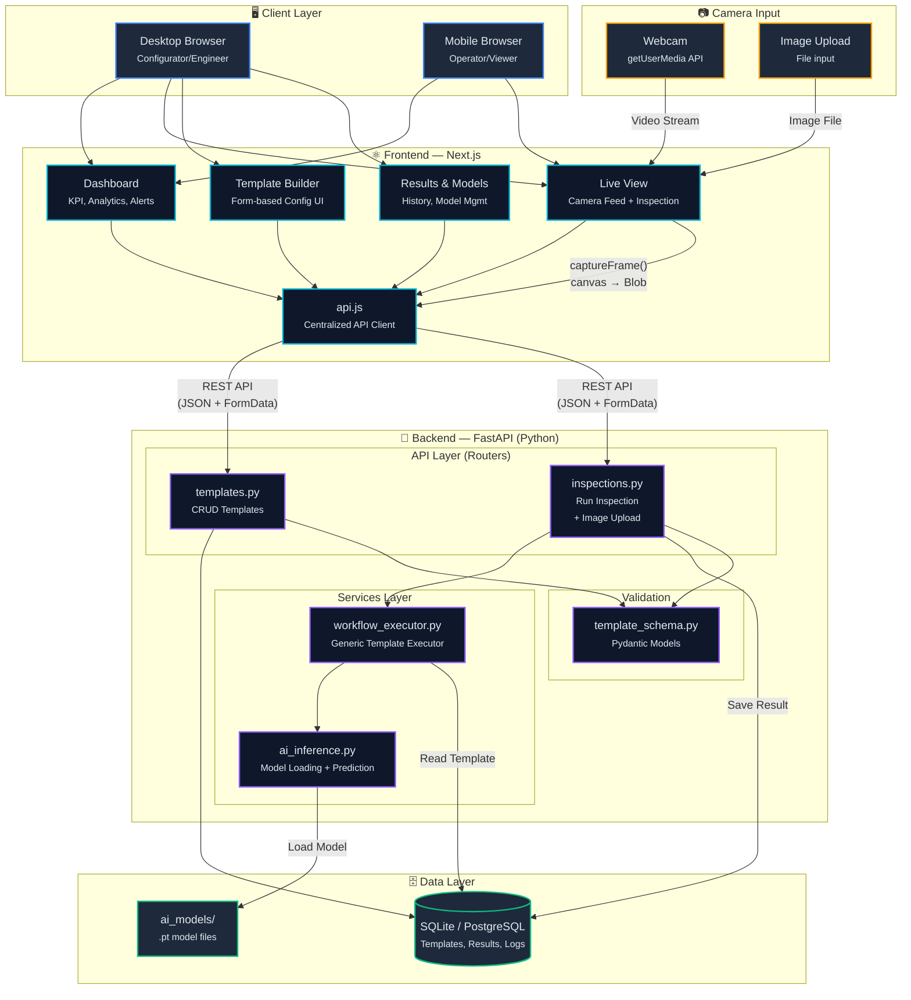
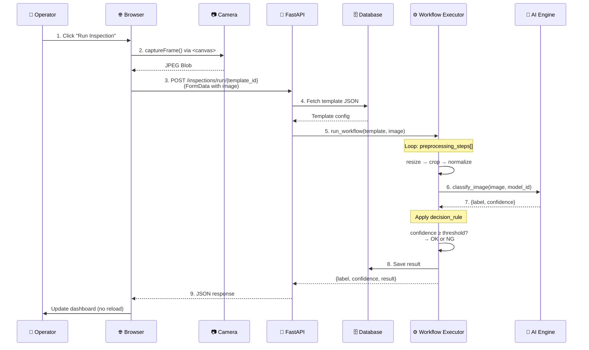

# Camera AI — System Architecture Diagram

## High-Level Architecture

---

## Inspection Flow — 9 Steps

This traces a single inspection from button click to result displayed:

---

## Component Responsibilities

| Component             | Technology    | Responsibility                                            | Owner      |
| --------------------- | ------------- | --------------------------------------------------------- | ---------- |
| **Frontend**          | Next.js       | Dashboard, template builder, live view, results           | **Nabil**  |
| **API Layer**         | FastAPI       | REST endpoints, request validation, routing               | **Darrel** |
| **Workflow Executor** | Python        | Generic template runner — the "no hardcoded logic" engine | **Darrel** |
| **AI Inference**      | PyTorch       | Model loading, image preprocessing, prediction            | **Habil**  |
| **Database**          | SQLite        | Stores templates (config) and results (history)           | **Darrel** |
| **Camera Input**      | WebRTC / File | Captures frames from webcam or accepts uploaded images    | **Nabil**  |

---

## Key Architecture Principles

> [!IMPORTANT]
> **Configuration-driven, not hardcoded**: The same `run_workflow()` function handles every template. New inspection types = new database rows, not new code.

> [!TIP]
> **Separation of concerns**: Frontend never touches AI logic. Backend never renders UI. The API layer is the only bridge between them.

> [!NOTE]
> **Swappable components**: Camera, AI model, and client devices can all be changed independently without affecting other layers.
