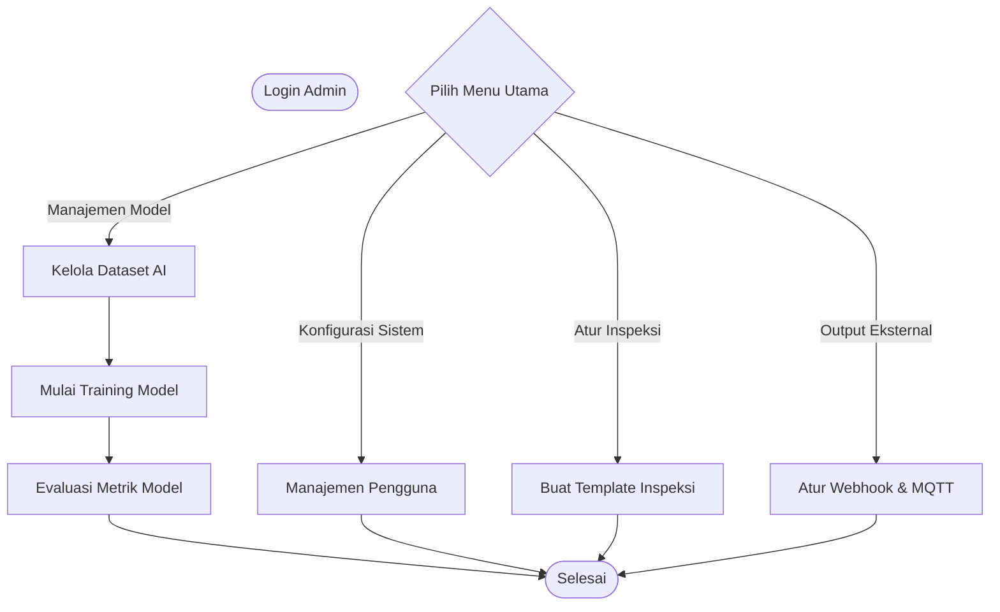
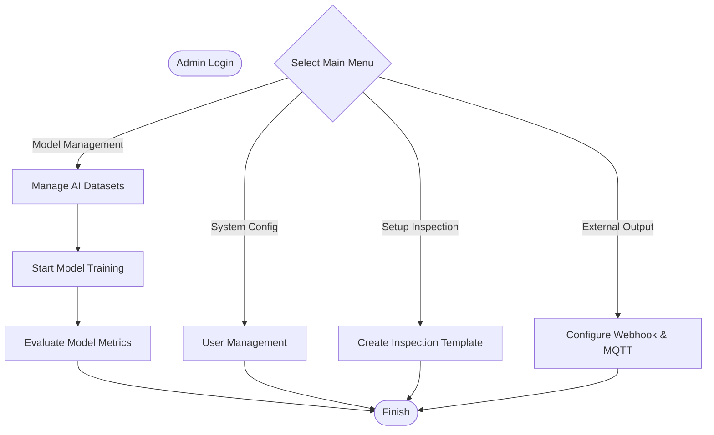
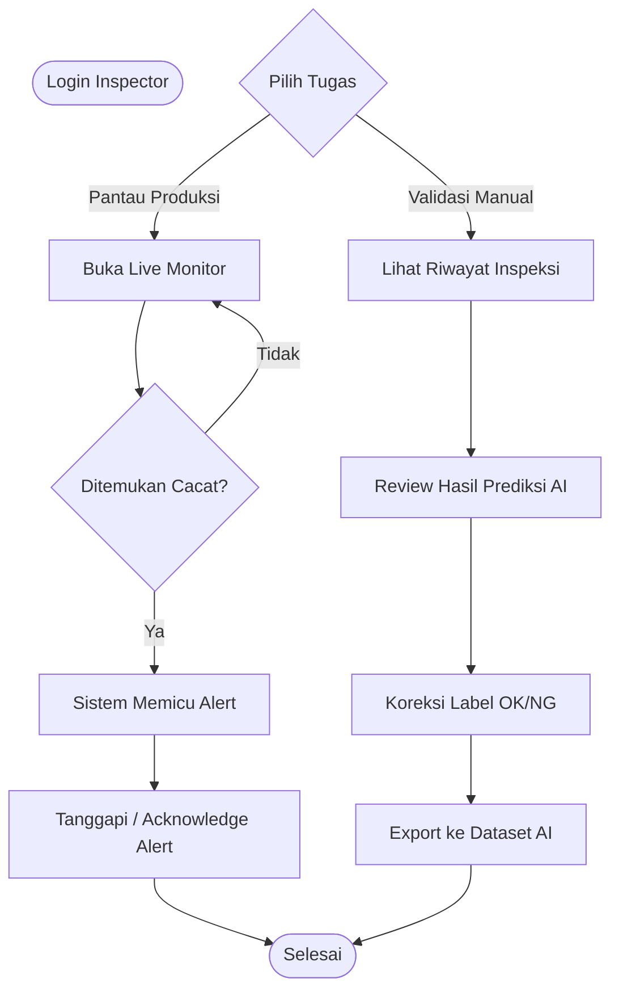
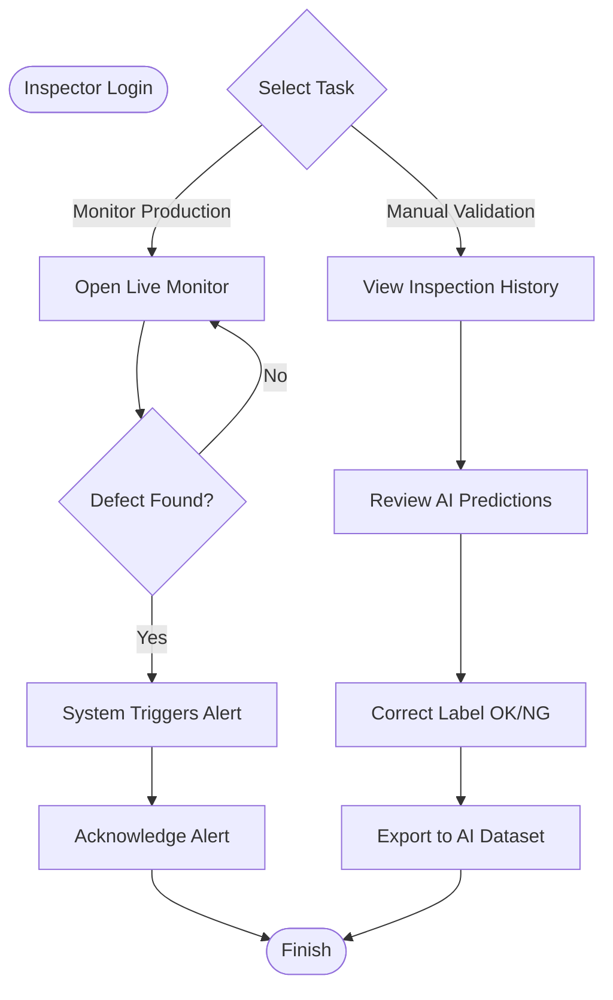

# Draw.io Role Workflow Templates

Berikut adalah template *Mermaid* untuk alur kerja (*Workflow / Jobdesk Pipeline*) spesifik berdasarkan pembagian peran **Admin** dan **Inspector**. Diagram ini sangat cocok untuk menggambarkan *SOP* (Standar Operasional Prosedur) dari masing-masing pengguna.

### 🛠️ Cara Memasukkan ke Draw.io
1. Klik **Arrange** -> **Insert** -> **Advanced** -> **Mermaid...**
2. Salin (*Copy*) salah satu kode dari kotak di bawah.
3. Tempel (*Paste*) ke dalam *pop-up* Draw.io dan klik **Insert**.

---

## 1. Pipeline / Alur Kerja ADMIN

Sebagai **Admin**, tugas utamanya berfokus pada manajemen sistem, melatih (training) model kecerdasan buatan, dan mengatur integrasi perangkat keras eksternal.

### 🇮🇩 Versi Indonesia (Admin)

### 🇬🇧 English Version (Admin)

---

## 2. Pipeline / Alur Kerja INSPECTOR

Sebagai **Inspector** (Operator Lini Produksi), tugas utamanya adalah memantau jalannya sistem deteksi secara *real-time*, menanggapi *alert* jika terjadi cacat (NG) beruntun, serta memvalidasi/melabeli ulang prediksi AI yang kurang akurat untuk bahan *training* selanjutnya.

### 🇮🇩 Versi Indonesia (Inspector)

### 🇬🇧 English Version (Inspector)

