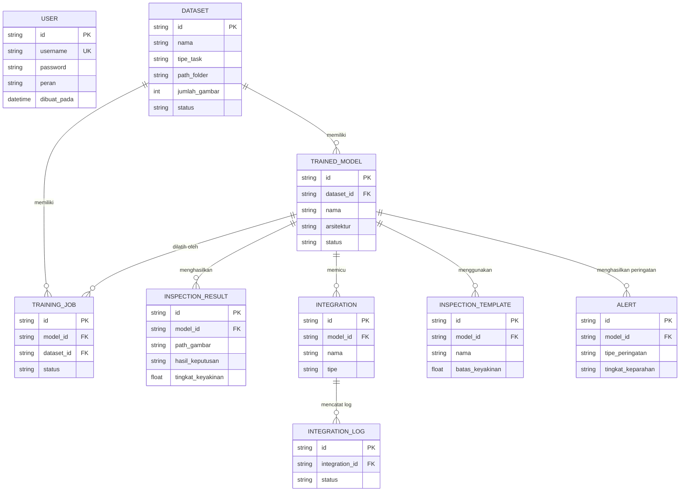
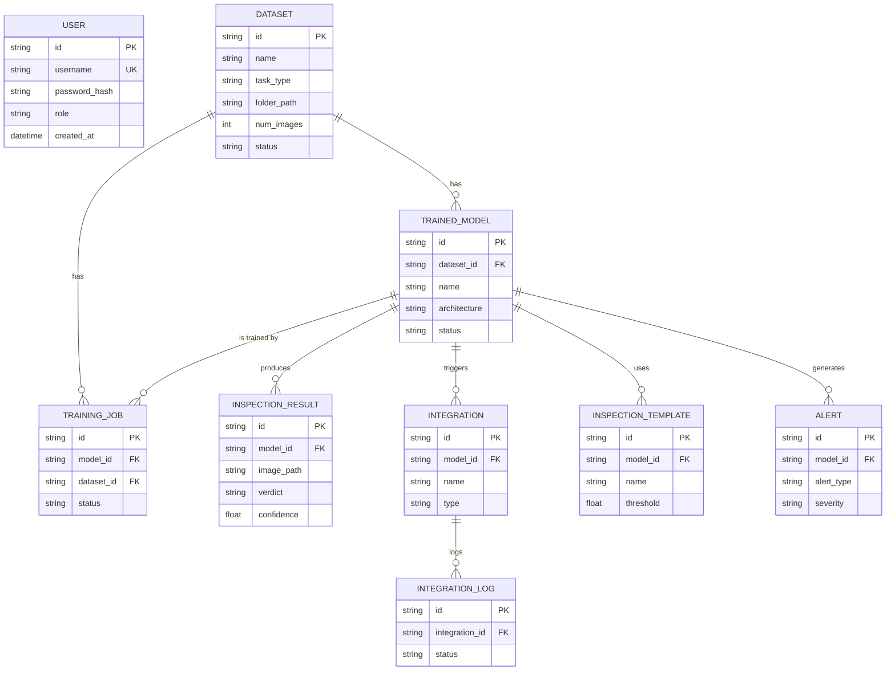
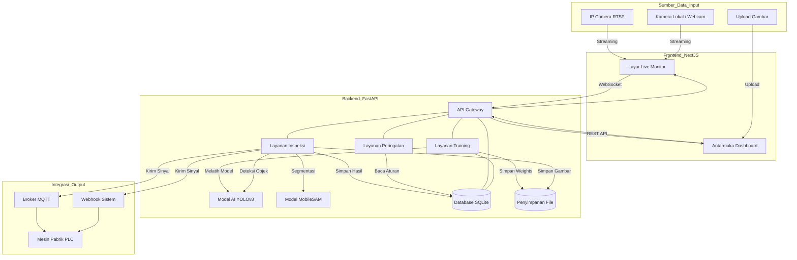
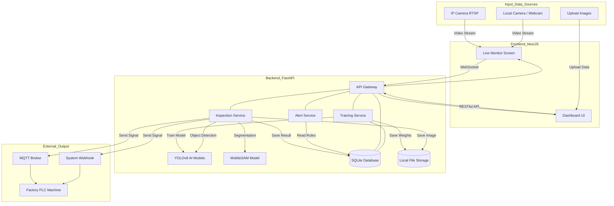

# Draw.io Import Templates

Draw.io memiliki fitur luar biasa yang memungkinkan Anda untuk langsung mengkonversi teks berupa kode *Mermaid* menjadi blok diagram interaktif (bisa digeser dan diedit ulang warnanya).

### 🛠️ Cara Memasukkan ke Draw.io
1. Buka [app.diagrams.net](https://app.diagrams.net/) (Draw.io).
2. Di menu bagian atas, klik **Arrange** -> **Insert** -> **Advanced** -> **Mermaid...**
3. Salin (Copy) salah satu kode di bawah ini.
4. Tempel (Paste) ke dalam kotak teks yang muncul di Draw.io, lalu klik **Insert**.

---

## 1. ERD (Entity-Relationship Diagram)
*Pilih salah satu bahasa di bawah ini.*

### 🇮🇩 Versi Indonesia (ERD)

### 🇬🇧 English Version (ERD)

---

## 2. System Architecture / Pipeline
*Pilih salah satu bahasa di bawah ini. Diagram ini dioptimalkan khusus agar tidak error saat diimpor ke Draw.io.*

### 🇮🇩 Versi Indonesia (Pipeline)

### 🇬🇧 English Version (Pipeline)

