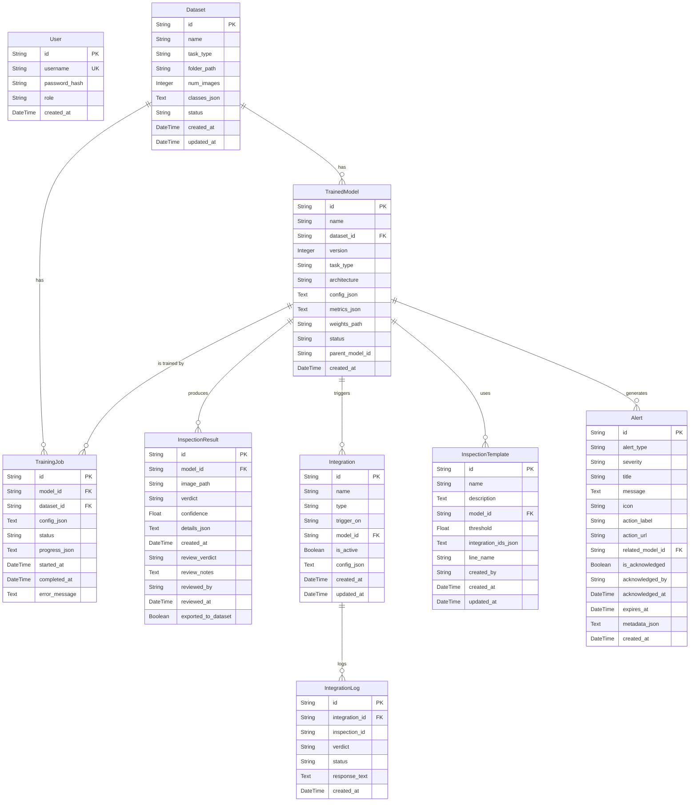

# Entity-Relationship Diagram (ERD) - Camera-AI-VeriVision

Below is the complete ERD of the Camera-AI-VeriVision project based on the `backend/models.py` database schema.

### Entity & Pipeline Summary:
1. **User**: Stores authentication data and roles (admin / inspector).
2. **Dataset**: Stores image metadata used for training models, with relationships to *TrainedModel* and *TrainingJob*.
3. **TrainedModel**: The core of the AI system. Derived from a *Dataset*, it is used to generate *InspectionResult* (detection results), is linked to *InspectionTemplate*, triggers *Integration*, and is associated with *Alert* for anomalies.
4. **TrainingJob**: Tracks the state and progress of the system while training a *TrainedModel* using data from a *Dataset*.
5. **InspectionResult**: Stores the actual detection results per frame/image (Verdict OK/NG), and provides a Manual Review feature by a *User* which can be exported back to a *Dataset*.
6. **Integration & IntegrationLog**: Manages external connections (Webhook / MQTT) triggered when the model makes a specific detection (e.g., machinery rejecting an item if Verdict = NG). 
7. **InspectionTemplate**: High-level configuration for an inspection scenario (e.g., on "Line Alpha", with a specific confidence threshold).
8. **Alert**: A smart notification system to warn users about issues (e.g., *burst_defect*, *low_yield*).

The pipeline above supports the automation of the entire process: **Data Collection (Dataset) -> AI Model Training (TrainingJob & TrainedModel) -> Real-time Inspection (InspectionResult) -> External Actions (Integration) -> Smart Notifications (Alert)**.
