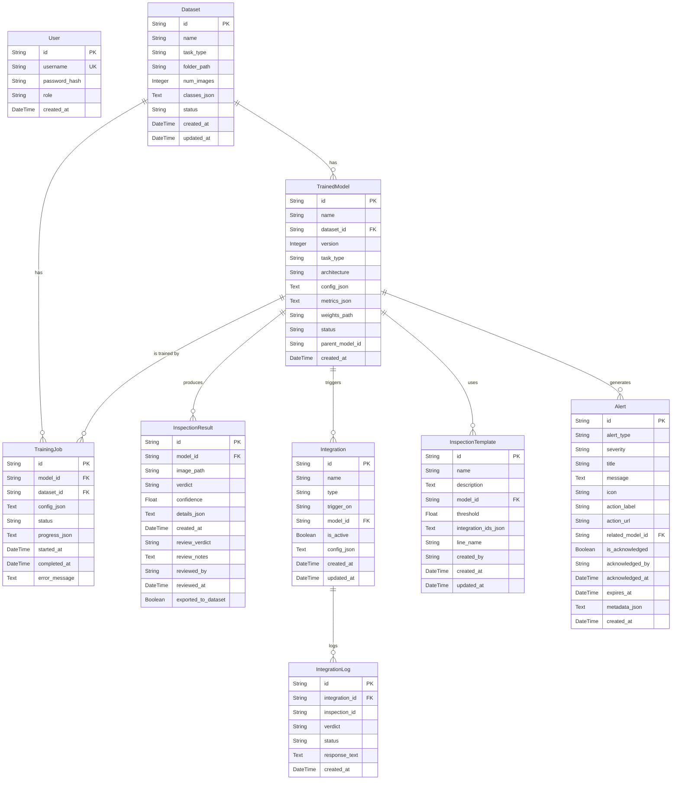

# Entity-Relationship Diagram (ERD) - Camera-AI-VeriVision

Berikut adalah ERD keseluruhan dari proyek Camera-AI-VeriVision berdasarkan skema database `backend/models.py`.

### Ringkasan Entitas & Alur (Pipeline):
1. **User**: Menyimpan data autentikasi dan peran (admin / inspector).
2. **Dataset**: Menyimpan metadata gambar yang digunakan untuk melatih model, dengan relasi ke *TrainedModel* dan *TrainingJob*.
3. **TrainedModel**: Sentral dari sistem AI. Model ini diturunkan dari sebuah *Dataset*. Digunakan untuk membuat *InspectionResult* (hasil deteksi), dihubungkan dengan *InspectionTemplate*, memicu *Integration*, dan terkait dengan *Alert* jika ada anomali.
4. **TrainingJob**: Menyimpan *state* dan *progress* saat sistem sedang melatih *TrainedModel* menggunakan data dari *Dataset*.
5. **InspectionResult**: Menyimpan hasil nyata deteksi per *frame*/gambar (Verdict OK/NG), serta menyediakan fitur *Manual Review* oleh *User* yang bisa di-export kembali ke *Dataset*.
6. **Integration & IntegrationLog**: Mengelola koneksi eksternal (Webhook / MQTT) yang dipicu ketika model melakukan deteksi tertentu (misal: mesin *reject* barang jika Verdict = NG). 
7. **InspectionTemplate**: Konfigurasi tingkat tinggi untuk skenario inspeksi (misal di *Line Alpha*, dengan threshold keyakinan tertentu).
8. **Alert**: Sistem notifikasi cerdas untuk memperingatkan pengguna tentang masalah (misal *burst_defect*, *low_yield*).

Pipeline di atas mendukung otomatisasi dari proses **Pengumpulan Data (Dataset) -> Training Model AI (TrainingJob & TrainedModel) -> Inspeksi Nyata (InspectionResult) -> Aksi Eksternal (Integration) -> Peringatan Cerdas (Alert)**.
