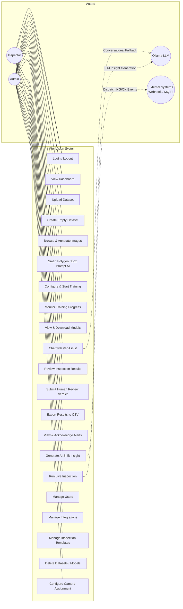
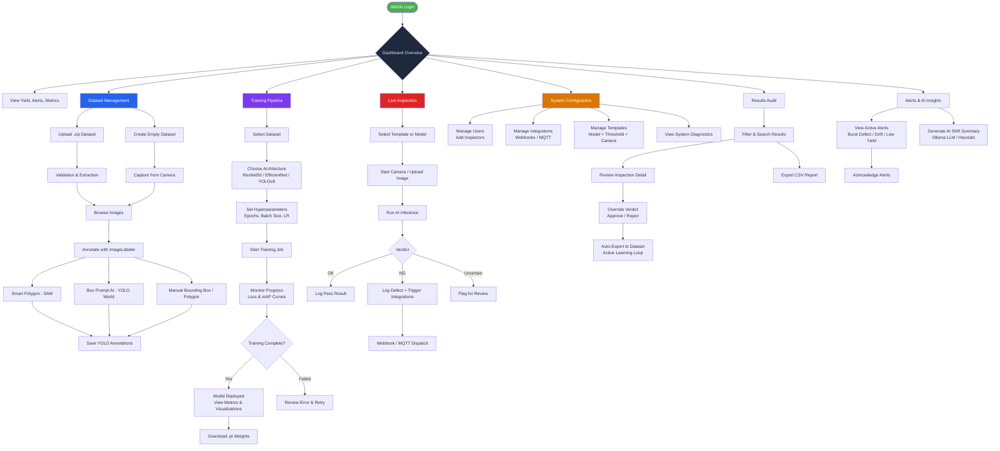
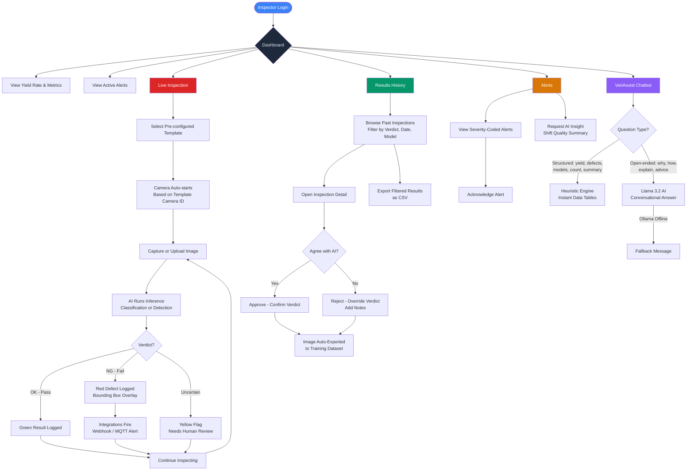
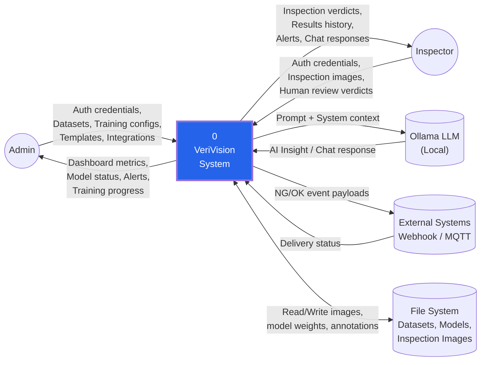
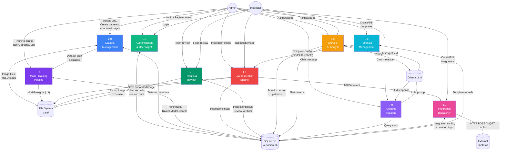
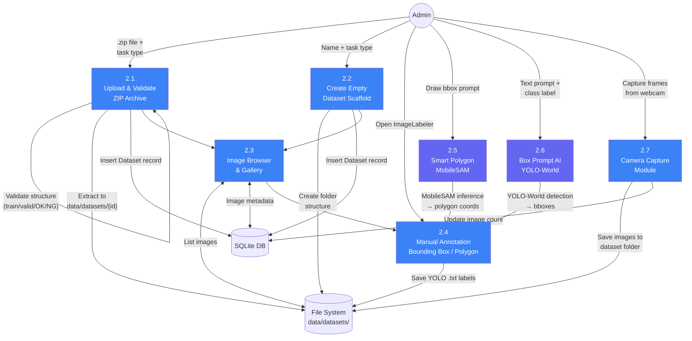
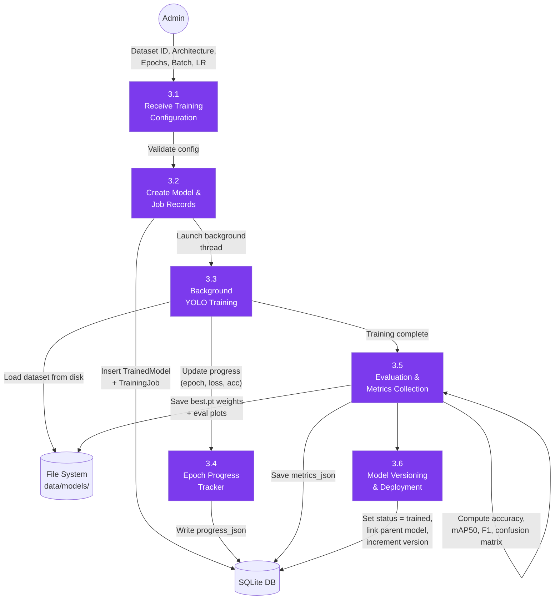
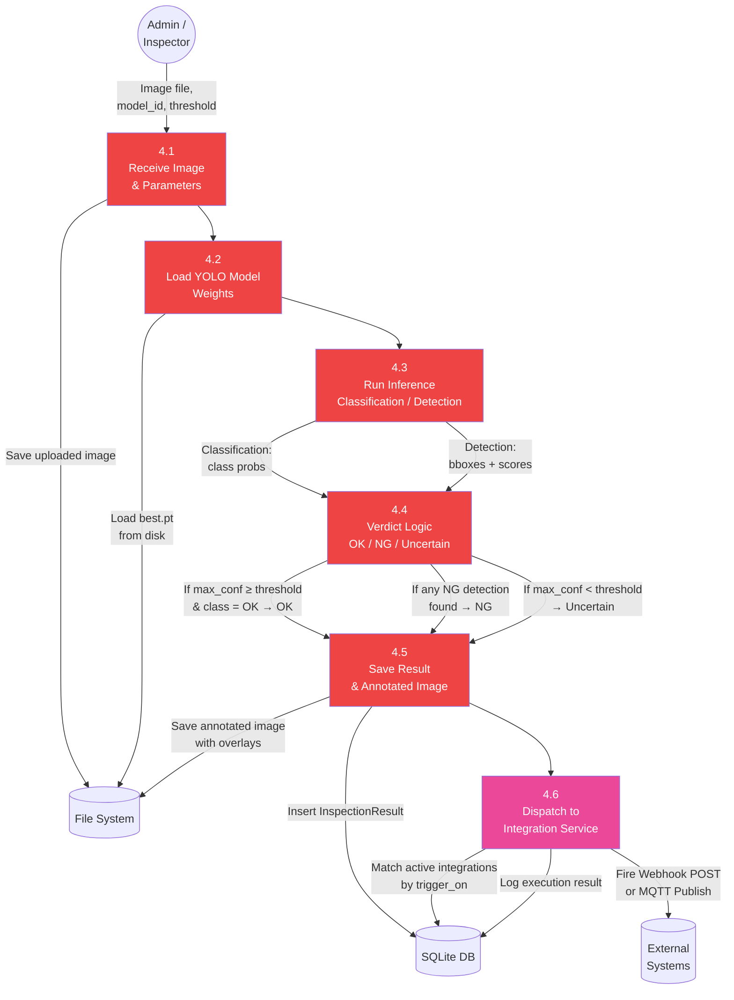
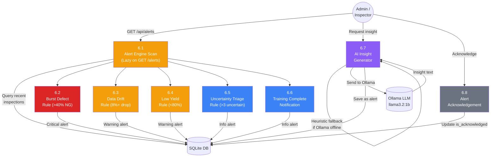
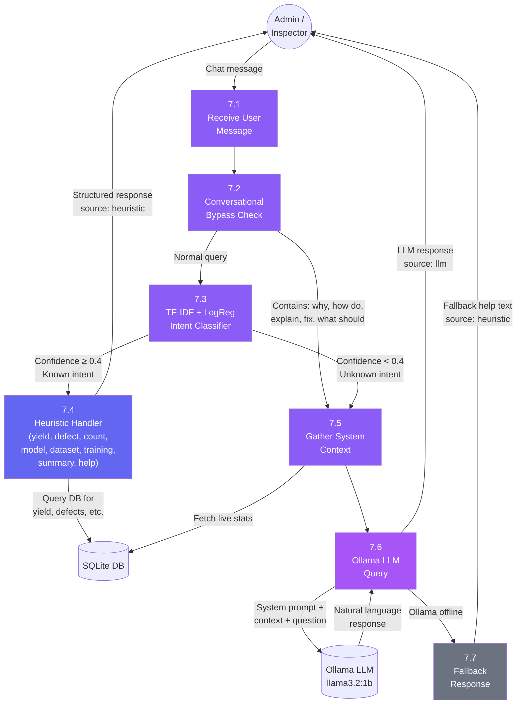

# VeriVision System Diagrams (Mermaid.js)

All diagrams below are based on the current VeriVision codebase.

---

## 1. Use Case Diagram

---

## 2. Admin Workflow Flowchart

---

## 3. Inspector Workflow Flowchart

---

## 4. DFD Level 0 (Context Diagram)

---

## 5. DFD Level 1

---

## 6. DFD Level 2

### 6.1 — Process 2.0: Dataset Management (Detailed)

### 6.2 — Process 3.0: Model Training Pipeline (Detailed)

### 6.3 — Process 4.0: Live Inspection Engine (Detailed)

### 6.4 — Process 6.0: Alerts & AI Analyst (Detailed)

### 6.5 — Process 7.0: Chatbot Assistant (Detailed)

